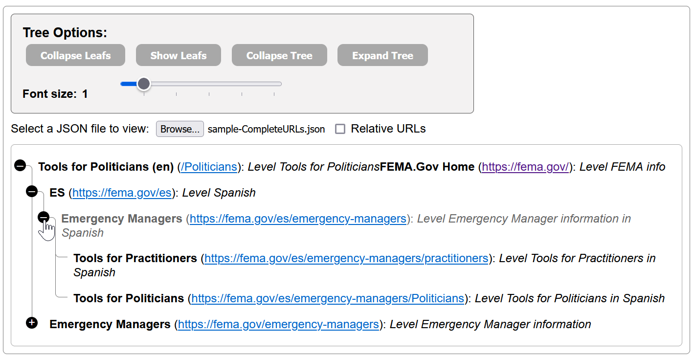
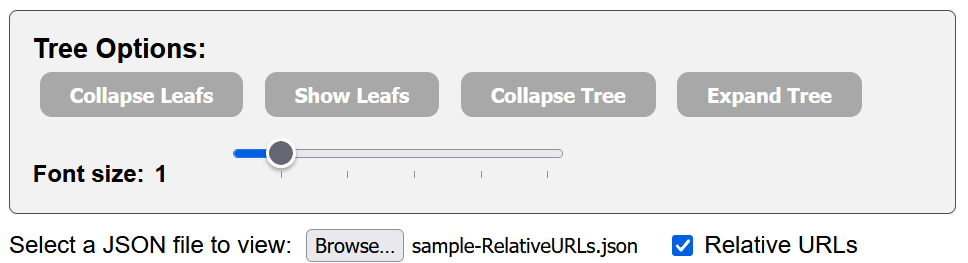

# ArcTree

> Create nicely formatted unordered list with arcs from JSON files with
> expand/collapse options &amp; variable font size.



## Introduction to ArcTree

This HTML + Javascript page will recurse through the file and build an unordered
HTML tree with nice arcs and collapsible nodes.

## ArcTree Options

There are also some options at the top (if shown the the user) that allows
collapsing or expanding the whole tree:


- **Collapse Leafs** will temporarily hide list nodes which have a blank
  children node, i.e., `children:[]`. If the `children` node is missing, things
  work, but they aren't considered leafs & won't be collapsed.
- **Show Leafs** just re-expands all nodes if any were hidden.
- **Collapse Tree** will collapse _all_ nodes in the entire tree, allowing users
  to gradually expand only the nodes they wish.
- **Expand Tree** expands (opens) all nodes in the tree, allowing users to
  selectively collapse any nodes they don't wish taking up visible space
- **Font Size** changes the font size between 0.5 on up to 5.0 in 0.5
  increments.
- **Browse** button allows selecting a JSON file formatted as shown above. Upon
  being selected, any existing tree is cleared and rebuilt.
- **Relative URLs** allows users to express whether their json file provides
  relative/incremental URLs or full/complete URLs. If changed, any existing tree
  is cleared and if a file has previously been selected, the tree is rebuilt.

## Formatting

Although not trivial, folks that know basic CSS can alter the symbols and colors
used to display open and closed nodes. I have tried to provide more
documentation as to what CSS affects various parts of the ArcTree!

## JSON Data File Format

JSON files are expected to be formatted as:

```JSON
{
    "title": "web page title",
    "url": "web page url",
    "meta": "web page description",
    "children": [
        {
            "title": "child page title",
            "url": "child page url",
            "meta": "child page description",
            "children": [{...}, {...}]
        },
        {
            "title": "child page title",
            "url": "child page url",
            "meta": "child page description",
            "children": []
        }
    ]
}
```

- URLs can be relative/incremental to their parent or specified completely, as
  noted in the Options section above.
- BUG: Currently the base URL is hardcoded in the `arc-tree.js` file! Search for
  `baseUrl = "https:\\fema.gov"` in the function `fileChange()` & manually
  change this for your situation.
- If the `children` node is missing, the tree will be built, but they won't be
  considered leafs & won't be collapsed if the user clicks the _Collapse Leafs_
  button.
- Additional attributes (akin to "title", "meta", or "url") can be included for
  each node, but will be denoted with "[Unknown node (" in the tree display.
  Adding new cases to the `switch` statement in `function buildArcTree` in the
  `arc-tree.js` file should be pretty trivial though.
- When opened, JSON files are validated just by seeing they have success with
  JSON.parse currently. In the future we may enable AJX validation which is more
  sophisticated. Read more about it at: https://www.npmjs.com/package/ajv.

## Debugging

- By default, the `arc-tree.js` file has `let verbose = false;` at the top.
  Change this to `true` if you wish to track output and see errors, warnings and
  verbose information. These can be viewed by opening any browser's developers
  tools(F12 by convention) and then it's 'console window'.

## License & Copyright

This is released under the permissive MIT License. For details see


Thanks to https://codepen.io/bisserof/pen/nrMveb for the nice formatting of the
arcs! Their original sample provided the inspiration for this project.

©2024, https://eoc.online

Credit for reuse of this is always appreciated!
