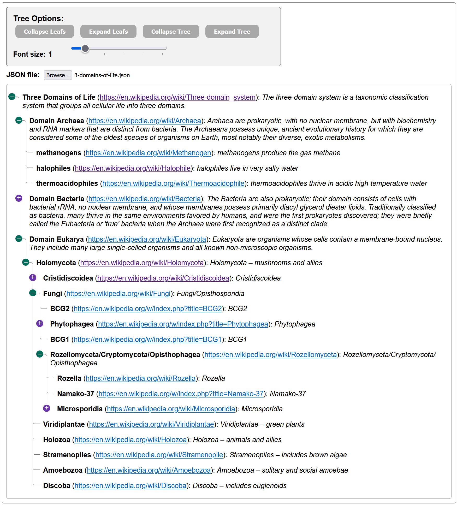

# ArcTree

> Create nicely formatted, unordered list with arcs from JSON files with
> expand/collapse options &amp; variable font size.



## Introduction to ArcTree

This HTML (+ Javascript + CSS) page displays a number of options (see below),
and allows the user to repeatedly select a formatted json file (see below). Once
a new file is selected ArcTree recurses through the file and builds an unordered
HTML tree.

Each parent node with children can be clicked to collapse/expand the node.
Sub-node's that are hidden retain their collapsed/expanded status with nice arcs
and collapsible nodes.

This is currently used for displaying a large website's sitemap nicely, so users
can collapse irrelevant sections and focus on those parts of the tree they are
most interested in. It should be readily adaptable for displaying other
tree-like structures.

## ArcTree Options

There are also some options at the top (if shown the the user) that allows
collapsing or expanding the whole tree:


- **Collapse Leafs** will temporarily hide list nodes which have a blank
  children node, i.e., `children:[]`. The `children` node is required even if
  empty.
- **Show Leafs** just re-expands all nodes if any were hidden.
- **Collapse Tree** will collapse _all_ nodes in the entire tree, allowing users
  to gradually expand only the nodes they wish.
- **Expand Tree** expands (opens) all nodes in the tree, allowing users to
  selectively collapse any nodes they don't wish taking up visible space
- **Font Size** changes the font size (in em units) between 0.5 em on up to 5.0
  em in 0.5 increments.
- **Browse** button allows selecting a JSON file formatted as shown above. Upon
  being selected, any existing tree is cleared and rebuilt.

## Display Formatting

Although not trivial, folks that know basic CSS can alter the symbols and colors
used to display open, closed & artificial nodes. The CSS file contains some
documentation as to what CSS affects various parts of the ArcTree.

## Installation & Running

After browsing to https://github.com/EOCOnline/ArcTree, you can use your git
skills to clone the project locally or select the green `<> Code` button and
download a zip file of the project to your computer. Unzip the file & then just
open the ArcTree.html in your favorite browser. You should see a screen like
that above. Select the `Browse` button to select a JSON file to display. (See
the Samples section below for files known to work.)

## Sample JSON Files

https://github.com/EOCOnline/ArcTree has a `Samples` directory with a number of
sample JSON files in either the `Full URLs` or `Relative URLs` directories. Use
ArcTree's `Browse` button to display an ArcTree for that file.

## JSON Data File Format

JSON files are expected to be formatted as:

```JSON
{
    "title": "web page title",
    "url": "https://www.sample.com",
    "meta": "web page description",
    "children": [
        {
            "title": "child page title",
            "url": "/1st-child",
            "meta": "relative child page description",
            "children": [{...}, {...}]
        },
        {
            "title": "another child page title",
            "url": "https://www.sample.com/2nd-child",
            "meta": "another fully specified child page",
            "children": []
        }
    ]
}
```

- URLs can be relative/incremental to their parent or fully-specified/complete
  URLs. If a url begins with "http", it is assumed to be a full url, otherwise
  the parent url will be prepended. (URL style can vary throughout the file, but
  only limited testing has been done on this aspect.)
  
- ArcTree automatically inserts 'artificial' intermediate URLs if needed between
  parent & child URLs. For instance from https://www.sample.com/ to
  https://www.sample.com/child1/child2 -- _without going thru
  https://www.sample.com/child1 first_. (We handle this by inserting a dummy
  list item with the missing intermediate child/parent page, though the website
  may not have such a page, resulting in potential 404 errors for the 'created'
  page.) This is done so you may collapse/expand the node as desired.
- Try https://duckduckgo.com/?q=json+validator as a nice way to spot formatting
  errors.
- When opened, JSON files are validated just by seeing they have success with
  JSON.parse currently.
- In the future we may enable AJX validation which is more sophisticated. Read
  more about it at: https://www.npmjs.com/package/ajv.
- The `children` node is essential, but can be an empty array (i.e., a leaf):
  `"children"=[]`

## Programming Notes

- Additional attributes (akin to "title", "meta", or "url") can be included for
  each node, but will be denoted with "[Unknown node (" in the tree display.
  Adding new cases to the `switch` statement in `function buildArcTree` in the
  `arcTree.js` file should be pretty trivial though. See the code comment.
- Adding additional arrays will require some coding, but the current code should
  provide some hints to make it 'fairly' painless.
- Only the initial call to `buildArcTree()` should ignore the optional URL
  value.

## Debugging

- To view potential errors & warnings, open your browser's developers tools
  (`F12` by convention) and then open it's 'console window'.
- By default, the `arcTree.js` file has `let verbose = 0;` at the top. Change
  this to `1`, `2`, or `3` to get progressively more verbose debugging
  information in the console window.

## License & Copyright

This is released under the permissive MIT License. For details see


Thanks to https://codepen.io/bisserof/pen/nrMveb for the nice css formatting of
the arcs! Their original sample provided the inspiration for this project.

©2024, https://eoc.online

Credit for reuse of this code is always appreciated!
